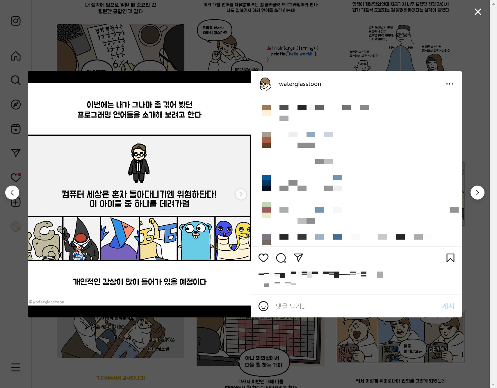

# 🎲 카드게임 커뮤니티 개발기

## 📂 개요

우선 기존에 하던 음원 차트 프로젝트를 유기(?)하고 좀 새로운 프로젝트를 시작하고 싶었다...

몇가지 이유가 있었는데 

첫째로 개발과정에서 중요한기능으로 생각하던 기능을 만들수 없게되버려서 프로젝트에 대한 의욕을 잃게됐다. 

짧게 얘기하자면 유튜브 API를 이용한 기능을 개발하려고 했는데 기획을 거치지 않고

"이거 이렇게 해야겠다"라는 생각만 갖고 개발하다 재생목록을 만드는 과정에서 추가하려는 영상이 실재 존재하는지의 validation을 

거쳐야했기 때문에 API 할당량이 생각보다 굉장히 많이 들어 기능 구현에 어려움을 겪었다.

두번째로는 서비스 이용자를 많아지게 할 수 있는 방법들이 생각보다 신경써야할 점이 많았다.

광고를 하기에도 좀 부담이 됐고, 딱히 홍보할곳도 마땅치않아 사이트 이용에 관한 피드백이나 의견들을 듣기가 어려웠다.

그래서 이 프로젝트를 어떻게 해야하나.. 고민하던 와중에 [당시에 취미로 하던 게임](https://www.marvelsnap.com/)의 관련 정보들을 알아보기위해 

커뮤니티 사이트들을 좀 둘러보다 한국 커뮤니티 사이트가 없는걸 알게됐다.

물론 이미 만들어진 해외 사이트를 유용하게 사용할 수 있었지만 광고가 너무 많고, 사이트 속도가 너무 느려서 이용하기가 불편했다.

이런점들과 [과거에 했던  게임관련 웹프로젝트](https://redgee.notion.site/DUNPIC-NET-7fb8313cc4bf45f887e1e7c0530be4ba)가 여러 커뮤니티에서 자생적으로 홍보되어 피드백이나, 의견들을 들을 수 있던것이 생각나

내가 한번 개발해볼까 라는 마음으로 진행해보기로 했다.

## ❓ 뭘 개발했나

먼저 사이트내에서 다루는 가장 큰 주제인 **마블스냅**이라는 **카드게임**에서는 16장의 각기 다른 카드를 하나의 덱(카드뭉치)으로 구성해 경쟁하여 승부하는 게임이다.

**쉽게 비유하자면 16마리의 포켓몬들을 카드의 형태로 이용해 싸우는 게임**이라고 이해하면 될것같다.

이러한 카드 게임의 특징으로는 어떤 16장의 카드를 조합 하느냐에 따라 전략의 다양성을 늘리는데

경쟁이 이루어지는 만큼 어떤 덱(조합)이 가장 효과적인지, 가장 효과적인덱을 어떻게 대항하는지가 눈치싸움처럼 이루어진다.

그렇기 때문에 짧게는 며칠내에 가장 강한덱이 바뀌고 이런 동향들을 지속적으로 체크해야 조금이라도 더 유리한점이 카드게임의 특징이다.

이러한 `덱`의 중요성 때문에 자신의 덱을 쉽게 공유할 수 있도록 `덱코드`라는 일정한 문자열을 입력하면 다른사람의 덱을 복사해올 수 있는 기능도 게임내에 마련되어있다.

하지만 공유하려는 사람이 덱을 공유할때 덱코드를 공유하는것이 아니라 스크린샷을 찍어 올리는것이 더 편하기 때문에 대부분의 유저들은 이런 방법을 자주 사용했고

이용하는 입장에서 덱코드를 입력하는것이 아닌 스크린샷을 보고 16장을 일일히 추가해 만들어야한다는 불편함이 있었다.

그렇기 때문에 사이트의 컨텐츠에서 자동으로 `덱코드`를 generate하고 버튼을 클릭하면 바로 복사해 올 수 있는 기능을 만들어 덱을 좀 더 편리하게 공유 할 수있도록 하는 기능을 만들었다.

---

두번째로는 `덱`의 구성에 대한 부분인데 아무리 좋은 카드의 구성이라해도 내가 갖지못한 카드가 포함되어있다면 쓸모없는 정보에 가까웠다.

게임내에서 카드를 갖는 과정은 특정 레벨에 도달하거나, 랜덤으로 얻어지는 방식인데 이 부분을 게임내에서 확인하기가 굉장히 어려웠다.

이러한점을 해결하기위해 사용자의 데이터를 받아 내 카드 보유 현황을 한눈에 확인하는 기능은 개발을 완료했고, 그로 만들수 있는 덱들을 필터링하는 기능을 만들고 있는 중이다.

이 과정에서 사용자의 데이터를 받기 위한 방법들중 여러가지 방법들을 생각해봤는데 [electron](https://github.com/jihunhong/marvelsnap-electron) 기반의 간단한 데스크탑 애플리케이션을 만들어

로그파일을 읽어 계정과 연동하는 기능도 같이 만들어 제공했다.

## 🧭프로젝트 설계

**백엔드**는 기존에 사용했던 express로 진행하려 했지만 개발 관련 유튜브를 보다 [아래 영상](https://youtu.be/Wqy3PBEglXQ?t=0s)을 발견했다.

`Pocket Base` 에 관해 설명하는 영상인데, 간단히 말해 Go를 기반으로 만든 Sqlite를 이용한 백엔드 플랫폼이다.

데이터베이스를 어드민으로 관리할 수도 있고 테이블의 형태에 따라 API도 자동생성해 주기 때문에 꽤 편리해보여 이용해봤다.

> development 단계이기 때문에 production에서 이용하는걸 아직 권장하진 않지만 회사 프로젝트가 아닌 개인 프로젝트 였기 때문에 이용해봤다.

**프론트엔드**는 `Next.js`를 이용했는데 `pocketbase`에서 생성된 API나 코드를 `Next`의 `Serverless function`에서 call하는 방식으로 설계했다.

그 이유는 아무래도 pocketbase를 이용하는 코드가 워낙 기존의 fetch, axios와는 이질적인 구조였고 pocketbase를 이용하는 부분을 컴포넌트 구조에서

분리하여 유지보수가 용이하도록 위함이었다.

요약해보자면 Serverless function에서 pocketbase를 이용하게두고 `SSR`과 `CSR`에서 이용되는 데이터 fetching 작업은 

serverless function에 해당하는 각각의 엔드포인트를 호출하도록 했다.

---

**컴포넌트 폴더 구조**는 회사에서 다뤘던 프로젝트나 기존에 진행했던 프로젝트를 atomic 패턴으로 나눴었는데

Molecules과 Organism의 구분이 컴포넌트 작성마다 고민되는 순간들이 굉장히 많았었다. 

또한 Atom과 Molecules도 이걸 "가장작은 단위로 봐야하나?" 라는 생각과 "두개 이상의 atom들이 합쳐져 만든 컴포넌트" 인데 이후에 변경되어 Organism으로 

옮겨지는등의 수정사항이 생긴다면 전체적인 구조가 흐트러지는 경우가 있었기 때문에 내 나름대로 기준을 다시 잡아 진행해봤다.

> 물론 회사에서 다루던 코드에 비해서 작은 규모의 프로젝트였다는 점도 폴더 구조 설계에 큰 영향을 끼쳤다

내가 잡은 기준을 짧게 설명해보자면 다음과 같았다.

- **@atoms** : 기초적인 UI 구성의 단위
    - *atoms 는 기존의 atomic 패턴에서의 atoms와 같은 역할*
- **@molecules** : atomic들의 집합이라면 무조건 여기에 해당
    - *사실상 기존의 Molecules과 Organism에 해당 하는 컴포넌트들을 모두 합쳐 관리하기로 했다.*
- **@template** : Page 단계 이전의 가장 상단에 위치하는 구조로, Page에서 이용되는 레이아웃을 제외하고는 가장 크게 구별되는 단위
- **@page** : 하나의 페이지, next의 pages 디렉토리에 위치한다

---

**상태관리**는 기존에 `redux`를 이용했었는데 이번에는 `recoil`과 `react-query`를 이용하여 Server State와 Client State 나눠 관리하는 방식을 이용했다.

기존 프로젝트에서 상태관리를 할때 Client State와 비동기 처리 로직에 관한 코드의 관리를 고민을 했었을 [당시 접했던 세미나](https://www.youtube.com/watch?v=MArE6Hy371c)가 생각나서 였다.

결과적으로 이 부분도 굉장히 만족했는데 우선 react-query를 이용하는 hook들을 따로 useCardList(), usePostList() 처럼 @query 폴더에 나누어 비동기 처리 로직을r 관리 할 수 있었으며, 처리 로직에 관한 코드도 간결하게 작성 할 수 있었다. (캐싱도 때에따라 효과적으로 이용할 수 있었다.)

recoil은 Server State와 분리된 Client내에서 이용하는 State들만을 관리할 수 있었다는점이 같이 이용하면서 느꼈던 장점이라고 생각된다.

## 👀 어떤 과정을 거쳤나

**백엔드**에 필요한 데이터들은 이미 존재하던 커뮤니티나 공식 사이트에서 `puppteer` 이용해 기초 데이터를 수집했고 워낙 pocketbase에서 지원해주는것들이 많아 

데이터베이스 관련해서는 수고를 좀 덜 수 있었지만... 아쉬웠던 점도 있었다. (아래 아쉬웠던점에 후술)

이미지의 경우, 빌드시간을 최대한 단축시키고 싶었고 퍼포먼스 최적화를 위해 저장해 놓은 이미지의 사이즈를 보여지는 UI에 따라 동적으로 관리하고 싶었다.

이를 위해 `웹 퍼포먼스 최적화`에서 배운 `imgix`로 이미지 리소스들을 관리하는 방법을 사용해봤는데 확실히 light house에서 감점당하는 요인들을 효과적으로 줄일 수 있었다.

---

**프론트엔드**는 최근에 아이패드를 샀기 때문에(?) 반응형도 지원을 하는 방향으로 개발했다.

이 과정에서 페이지마다 이용되는 레이아웃을 몇개정도 피그마나 아이패드에 그려보면서 최대한 css의 미디어 쿼리만으로 바뀔 수 있도록 설계, 구현했다.

next를 이용하는 이유가 검색엔진에 더 잘 노출되도록 하고 싶은것이 가장 큰 이유 였기 때문에 적절한 메타태그와 seo를 배치했다.

그리고 서비스 특성상 특정 기간동안에는 카드의 효과나 스펙이 변하지 않기 때문에 해당 페이지의 cache-control을 알맞게 수정했고

hydration 관련 퍼포먼스 이슈를 최대한 열심히 디버깅해가며 초기 로딩속도를 최대한 빠르게할 수 있도록 했다.

앞서 말했던 `덱`들을 보여주는 페이지에서는 시효성이 있는 데이터들이기 때문에 무한스크롤로 구현해 첫페이지 진입시 가장 최신의 데이터를 확인 할 수 있도록했다.

여기서 덱에 관한 자세한 정보를 보여주기위해 디테일 페이지로 진입하는 경우 뒤로가기를 했을때 마지막으로 본 지점으로 돌아가야하는 점과 소요시간을 줄이는데 시간을 굉장히 많이 쏟았다.

이점은 언뜻봐서는 사소해 보일 수도 있겠지만 이용자의 UX가 굉장히 저해되고, 사이트를 이탈하는 원인이 될 수 있기 때문에 반드시 해결해야하는 문제였기 때문이다.

처음 생각했던 방식은 디테일 페이지로 이동되기전에 sessionStorage에 스크롤 지점을 저장하고, 뒤로가기로 리스트 페이지에 진입했을때 저장된 지점으로 이동하는 것이었는데

이 방법은 디테일 페이지로 이동하고, 뒤로가기가 아닌 다른 페이지(home)으로 이동했다가 리스트로 진입한다면 스크롤이 복원된다는 문제점이 있었다.

그렇기에 여러가지 방법들을 시도해보며 찾은것이 인스타그램이나 트위터에서 주로 이용하는 [Route as Modal](https://github.com/vercel/next.js/tree/canary/examples/with-route-as-modal)이었다.

이를 통해 스크롤 관련 이슈를 깔끔하게 해결 할 수 있었고, shallow routing을 때에따라 이용하며 SEO가 보장된 페이지를 제공 할 수 있었다.

## 🔧 아쉬웠던점

pocketbase에서는 relation 설계가 mysql과는 다른점이나 n-gram search을 못쓰기 때문에 검색하는데도 좀 아쉬웠고 쿼리튜닝을 할려면 Go를 알아야하는데...

내가 보유한 카드의 현황에 따라 덱 리스트를 보여주기 위해서는 쿼리튜닝을 해야할것 같아 좀 알아봐야할것 같다.

 

이번 프로젝트에서는 번들사이즈를 최대한 낮추기 위해 디자인 라이브러리를 이용하지 않고 진행해봤는데

생각보다 습관적으로 사용하는 css코드들의 중복이 너무 많아 이 부분은 좀 아쉬웠던 점이기에 다음번에는 자주 중복되는 부분들을 토대로 미리 작성해놔야겠다는 생각도 들었다.

 

그리고 아무래도 현재 사이트내의 컨텐츠를 채우는 과정이 내가 따로 시간을 내서 덱관련 정보들을 수집하고 admin을 통해 등록을 일일히 해야하기 때문에 좀 번거로운데

OpenCV를 통해 스크린샷을 캡처하고 어떤 카드를 의미하는지 알아낼수있다면 주기적으로 컨텐츠를 채워넣을 수 있을거같은데 이 부분이 자동화가 안되어있는 상태라

어떻게 할지 좀 생각해봐야할것같다.

 

그동안은 자바스크립트로만 프로젝트를 진행했었는데 이번 프로젝트부터 타입스크립트를 사용해보니 확실히 어이없는 실수들이 많이 줄어들었다.

하지만 타입가드나 유틸리티 타입을 좀 능숙하게 사용하진 못하고 있는거 같아 리팩토링을 몇번 거쳐야될것같다.

## 후기

이번 프로젝트에서는 직장을 나와 공부하는동안 습득한 퍼포먼스 최적화 부분이 좀 유효하게 적용된것 같았다.

퍼포먼스 패널을 통해 hydration 시간을 줄였던게 내가 하면서도 정말 신기했고 확실히 중요한 작업이라 관련 내용들을 좀 더 찾아봐야겠다.
